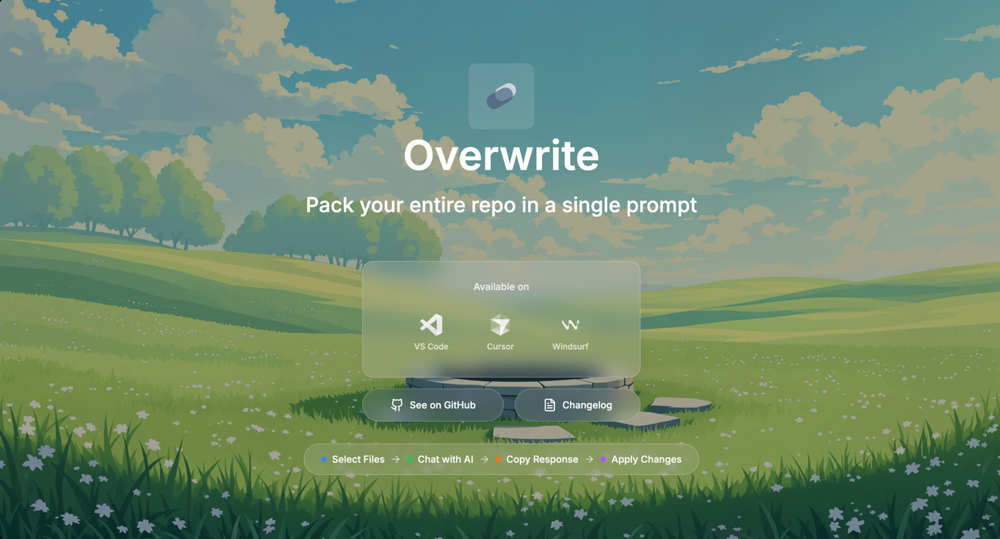
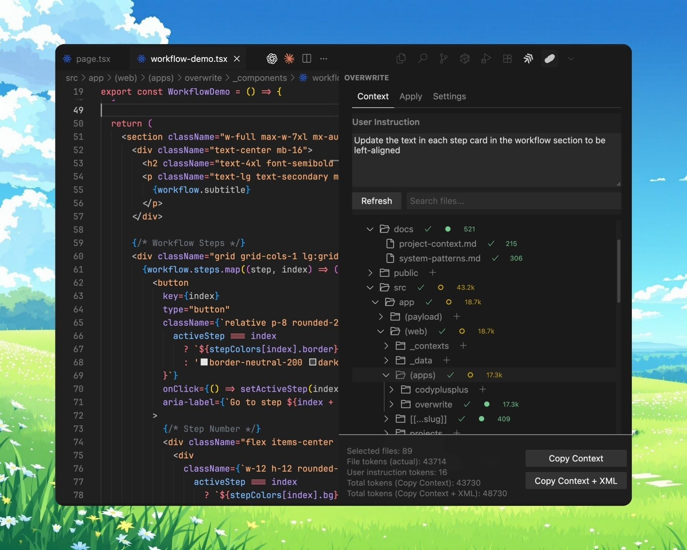
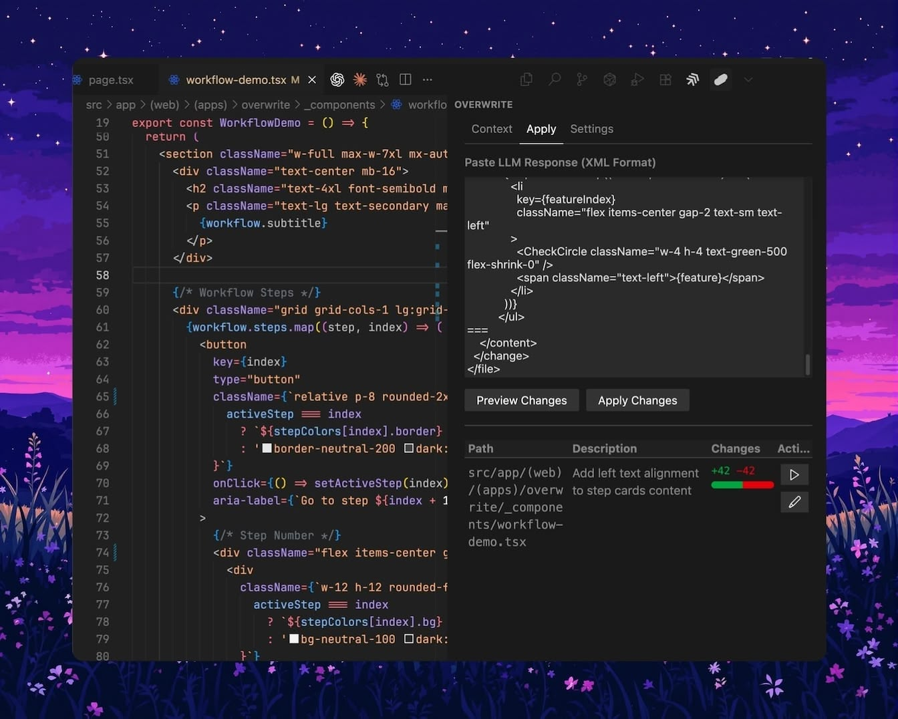

# Overwrite

  

Pack your entire repo in a single prompt

## Install

- For VSCode (VSCode Marketplace): <https://marketplace.visualstudio.com/items?itemName=mnismt.overwrite>
- For Cursor/Windsurf (OpenVSX): <https://open-vsx.org/extension/mnismt/overwrite>

## Features

- Explorer
  - Select files/folders with search and refresh; double‑click to open files.
  - Token counting per file and folder rollups; multi‑root workspaces supported.
  
- Context
  - Copy XML with <file_map>, <file_contents>, <user_instructions>, optionally <xml_formatting_instructions>.
  - Context is generated on copy (no heavy UI rendering).

  

- Apply
  - Paste LLM XML and preview diffs (create/modify/rewrite/delete/rename) before applying.
  - Apply safely via VS Code APIs with undo/redo and clear error feedback.

- Settings
  - Excluded folders editor and optional .gitignore support (in progress).
  - Privacy-preserving telemetry controls.

  

## How to use

1. Open Overwrite from the Activity Bar.
2. In Explorer/Context, pick files and add your task instructions.
3. Click Copy Context (or Copy Context + XML Instructions) and paste into your LLM.
4. Paste the LLM XML response into Apply, preview diffs, then apply.

## Privacy & Telemetry

Overwrite includes **optional, anonymous telemetry** to help improve the extension. We collect usage patterns and performance metrics while maintaining strict privacy:

- **Anonymous data only** - No file paths, contents, or personal information
- **Transparent implementation** - All telemetry code is open source
- **Easy opt-out** - Disable via VS Code settings or extension preferences

For complete details, see [TELEMETRY.md](TELEMETRY.md).

## Requirements

- VS Code 1.85.0+

## Acknowledgments

This project is heavily inspired by [RepoPrompt](https://repoprompt.com/) by @provencher.
